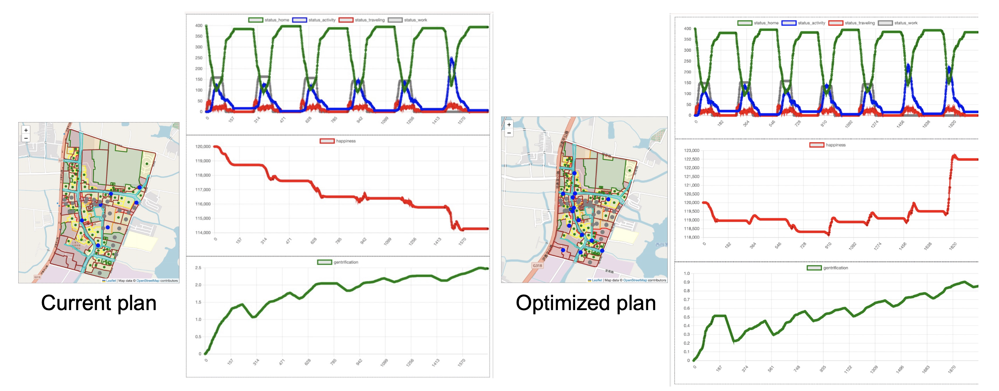

# ResJinze Project

## Table of Contents
- [Project Overview](#project-overview)
- [Installation](#installation)
- [Project Structure](#project-structure)
- [Running the Project](#running-the-project)
- [Dependencies](#dependencies)
- [Contributing](#contributing)

## Project Overview
### Overview
ResJinze is a spatial agent-based modeling (ABM) project that simulates interactions between urban areas, tourist flows, and various socio-economic factors. The project uses **Mesa** for the ABM framework and **GeoMesa** to handle geospatial data efficiently. The simulation focuses on a defined campus area and models the behavior of agents, including areas, roads, and towns.
### Objective
The objective of ResJinze is to investigate the process of **gentrification** and social resilience in traditional ancient town settings, particularly in response to increasing tourist influx and commercial development pressures. The model is based on the principles of the **Schelling model**, where tolerance toward the presence of outsiders plays a central role.
### key concepts
- **Tolerance Threshold**: As residents' tolerance toward outsiders reaches a critical threshold, it triggers out-migration, a key signal of the onset of gentrification.
- **Daily Interactions**: Regular interactions between different social groups can increase tolerance, potentially delaying the out-migration process.
- **Commercial Development Potential**: Areas with high levels of activity are identified as having greater potential for commercial development, which can further accelerate out-migration as local dynamics shift.

## Installation
1. Set the necessary environment variables:
    ```bash
    export PYTHONPATH=/path/to/your/ResJinze:$PYTHONPATH
    ```
   
2. Navigate to the project directory:
    ```bash
    cd /path/to/your/ResJinze
    ```

3. Install the required Python packages:
    ```bash
    pip install -r requirements.txt
    ```


## Project Structure

Here is an overview of the key files in this project:

- `area.py`: Contains the `Area` class representing the individual areas in the model. Each area has attributes like `geometry`, `gent_ind`, `isol_ind`, and handles spatial properties such as centroid and entrance points.
- `geo_agents.py`: Defines the geo-based agents that interact within the simulation.
- `group.py`: Handles the grouping logic for different clusters of agents in the simulation.
- `road_network.py`: Defines the road network and related attributes, such as distances and connectivity between different locations.
- `town.py`: Contains the logic related to town agents and their interactions in the model.
- `utils.py`: Utility functions that are shared across the project, such as loading data, computing specific metrics, or file management.
- `model.py`: The core model logic for setting up and running the simulation, including initialization of the agents and running the simulation steps.
- `server.py`: The backend server that connects the model to a frontend for visualization, using the `Mesa` framework.
- `run.py`: The entry point of the project, responsible for initializing the model and running the simulation.

## Running the Project

To run the simulation, use the following command:

```bash
python3 scripts/run.py --town jz
```

This command will start the simulation with the "ub" (urban block) dataset and visualize the interactions between areas, agents, and tourists.

## Outputs
the running of this project will output following files:
- `density_gen.csv`: the general population density for different areas in the simulation
- `density_home.csv`: home-based population density, specifically focusing on people residing in particular areas
- `density_local.csv`: local population density, focusing on the people in an area that are non-commuters or non-tourists
- `density_tourist.csv`: tourist population density over time, capturing the density of visitors or transient populations in specific areas during the simulation
- `gentri.csv`: gentrification indicators over time or across different regions
- The application of this model can be found in `application of model.pdf`

## Dependencies

Make sure you have the following dependencies installed:
- Python 3.8+
- Mesa
- GeoMesa
- Geopandas
- Shapely
- Pyproj

You can install the dependencies by running:

```bash
pip install mesa geomesa geopandas shapely pyproj
```

## Contributing

Feel free to fork the repository and submit pull requests. For major changes, please open an issue first to discuss what you would like to change.

